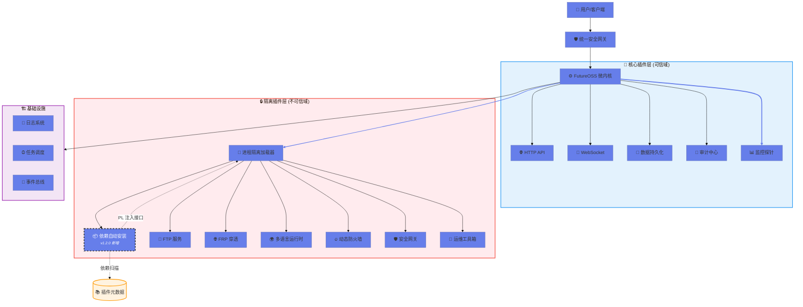

# 🚀 FutureOSS <span style="font-size:1.5em;color:#667eea">v1.2.0</span> 企业级插件化运行时框架

<div align="center">


<br>

## ✨ **重新定义安全 · 智能 · 全能的插件生态**

### 🎯 *零配置部署 · 进程级隔离 · 多语言支持 · 智能依赖管理*

[📖 完整文档](#-文档) | [🚀 极速开始](#-快速开始) | [🔌 插件宇宙](#-插件生态) | [🏗️ 架构解密](#-架构设计) | [💬 社区讨论](#-社区)

</div>

---

## 🎉 v1.2.0 震撼发布：智能依赖管理系统

> ### 🌟 **革命性突破 - 彻底告别依赖安装烦恼！**
> 
> 想象一下：只需声明你的插件需要什么，剩下的交给 FutureOSS！
> 
> | 🚀 核心能力 | 💡 技术亮点 |
> |:----------:|:-----------|
> | 🔍 **AI 驱动扫描** | 智能识别所有插件的系统依赖声明，自动聚合去重 |
> | ✅ **实时状态检测** | 毫秒级检测依赖包安装状态，精准识别缺失项 |
> | 📦 **一键自动化安装** | 支持 apt/yum/dnf/pacman/brew/apk 六大主流包管理器 |
> | 🔌 **PL 注入接口** | 深度集成插件加载器，实现真正的无人值守运维 |
> | 🔄 **智能回滚机制** | 安装失败自动回滚，确保系统稳定性 |
> | 📊 **可视化报告** | 生成详细依赖清单与安装进度报告 |

---

## 🚀 为什么选择 FutureOSS？

<details open>
<summary><b>🛡️ 极致安全架构 - 重新定义插件安全边界 (点击展开)</b></summary>

#### 🔒 进程级隔离 2.0
- **下一代 `ProcessIsolatedLoader`**: 每个不可信插件运行在独立沙箱进程中
- **零信任安全模型**: 默认拒绝所有权限，按需最小化授权
- **内存隔离保护**: 杜绝内存泄露、缓冲区溢出等低级漏洞
- **逃逸防护**: 多层防御机制，即使单个插件被攻破也不影响全局

#### 🔥 动态防火墙 Pro
- **状态检测引擎**: 基于连接状态的智能规则匹配
- **热加载能力**: 无需重启即可更新防火墙策略
- **实时流量分析**: 可视化展示入站/出站流量
- **异常行为熔断**: 检测到攻击自动触发保护机制

#### 📝 全链路审计中心
- **操作日志记录**: 记录每一次 API 调用、文件访问、网络请求
- **异常行为告警**: AI 驱动的异常检测，实时推送告警通知
- **合规性报告**: 自动生成 SOC2、GDPR 合规性报告
- **数据保留策略**: 灵活的日志保留与归档策略

#### 🔐 统一安全网关
- **多因子认证**: 支持 TOTP、WebAuthn、硬件密钥
- **防注入攻击**: SQL 注入、XSS、命令注入全面防护
- **防越权访问**: 基于 RBAC 的细粒度权限控制
- **防重放攻击**: 时间戳 + 随机数双重验证

</details>

<details>
<summary><b>🌐 全栈多语言运行时 - 一套框架，无限可能 (点击展开)</b></summary>

#### 🐍 Python 生态
- **虚拟环境隔离**: 每个插件拥有独立的 pip 环境
- **版本智能切换**: 自动管理 Python 3.8/3.9/3.10/3.11
- **异步支持**: 原生支持 asyncio，高并发场景游刃有余
- **C 扩展兼容**: 无缝集成 NumPy、Pandas 等科学计算库

#### 🟢 Node.js 生态
- **包管理器自由**: npm/yarn/pnpm 随意切换
- **版本管理**: nvm 集成，支持 LTS 与 Latest 版本
- **TypeScript 支持**: 开箱即用的 TS 编译管道
- **前端构建**: Webpack/Vite/Rollup 自动构建

#### 🔵 Go 生态
- **模块化编译**: 按需编译，减小二进制体积
- **静态链接部署**: 零依赖部署，跨平台无忧
- **性能优化**: CGO 优化，发挥 Go 语言极致性能
- **微服务友好**: 内置 gRPC、HTTP/2 支持

#### ☕ Java 生态
- **构建工具集成**: Maven/Gradle 自动构建
- **JVM 调优**: 根据容器资源自动调整堆内存
- **热部署支持**: JRebel 集成，开发效率翻倍
- **Spring Boot 兼容**: 一键部署 Spring Boot 应用

#### 🐘 PHP 生态
- **Composer 依赖**: 自动解析与安装 PHP 依赖
- **FPM 进程管理**: 智能管理 php-fpm 进程池
- **框架支持**: Laravel/Symfony/ThinkPHP 开箱即用
- **性能加速**: OPcache 预加载，提升执行效率

</details>

<details>
<summary><b>🔧 企业级运维套件 - 让运维变得如此简单 (点击展开)</b></summary>

#### 🌐 内网穿透 Pro
- **FRP 深度集成**: 支持 TCP/UDP/HTTP/HTTPS/STCP 全协议
- **可视化配置**: WebUI 拖拽式配置隧道规则
- **智能路由**: 根据负载自动选择最优节点
- **加密传输**: TLS 1.3 加密，保障数据传输安全

#### 📁 高性能文件服务
- **FTP/SFTP 双协议**: 满足不同场景需求
- **断点续传**: 大文件传输不中断
- **配额管理**: 精细化控制用户存储空间
- **病毒扫描**: 上传文件自动病毒检测

#### 🤖 自动化运维机器人
- **定时备份**: 数据库、配置文件、日志自动备份
- **健康检查**: 定期检测服务状态，异常自动重启
- **故障自愈**: 检测到故障自动执行修复脚本
- **日志轮转**: 自动压缩归档历史日志

#### 📊 全方位监控告警
- **资源监控**: CPU/内存/磁盘/网络实时采集
- **业务指标**: QPS、响应时间、错误率等业务指标
- **阈值告警**: 支持邮件、短信、钉钉、企业微信
- **趋势预测**: 基于历史数据预测资源使用趋势

</details>

<details>
<summary><b>🎨 现代极简 WebUI - 美与功能的完美平衡 (点击展开)</b></summary>

#### ⚡ 零依赖架构
- **纯原生技术栈**: HTML5/CSS3/JavaScript，无构建步骤
- **秒级加载**: 首屏加载时间 < 100ms
- **离线可用**: PWA 技术支持，断网也能使用基础功能
- **SEO 友好**: 服务端渲染，搜索引擎完美索引

#### 📱 全平台响应式
- **自适应布局**: Desktop/Tablet/Mobile 完美适配
- **触控优化**: 移动端手势操作流畅自然
- **深色模式**: 护眼深色主题，夜间使用更舒适
- **无障碍访问**: WCAG 2.1 AA 标准，人人可用

#### 🎯 极简主义设计
- **视觉降噪**: 去除一切不必要的装饰元素
- **内容优先**: 让用户专注于真正重要的信息
- **一致体验**: 统一的视觉语言与交互规范
- **微动效**: 精致的动画细节，提升使用愉悦感

#### 🔌 可视化插件管理
- **一键安装/卸载**: 图形化操作，无需命令行
- **实时状态监控**: 插件运行状态一目了然
- **配置热更新**: 修改配置即时生效
- **日志实时查看**: 流式日志输出，问题定位更高效

</details>

<details>
<summary><b>🆕 智能依赖管理 - v1.2.0 杀手级特性 (点击展开)</b></summary>

#### 📋 声明式依赖配置
```json
{
  "name": "my_awesome_plugin",
  "version": "1.0.0",
  "system_dependencies": [
    "nginx",
    "redis-server",
    "postgresql",
    "nodejs",
    "golang"
  ],
  "package_manager": "apt-get"
}
```

#### 🔍 自动发现引擎
- **递归扫描**: 深度遍历所有插件目录
- **依赖聚合**: 智能合并重复依赖，避免重复安装
- **冲突检测**: 检测依赖版本冲突，提前预警
- **增量扫描**: 仅扫描变更插件，提升扫描效率

#### ✅ 智能检测算法
- **多策略验证**: dpkg/rpm/pacman 多包管理器检测
- **版本比对**: 精确匹配所需版本范围
- **可选依赖**: 区分必需与可选依赖，灵活处理
- **缓存机制**: 检测结果缓存，避免重复检测

#### 📦 自动化安装流程
- **原子操作**: 安装过程可回滚，确保系统一致性
- **并行安装**: 多个依赖包并行安装，提升速度
- **进度追踪**: 实时显示安装进度与日志
- **错误处理**: 友好的错误提示与解决建议

#### 🔌 PL 注入接口深度集成
- **生命周期钩子**: 插件加载前自动检查依赖
- **事件驱动**: 依赖安装完成触发插件初始化
- **API 调用**: 通过 `/PL` 接口编程式控制
- **权限控制**: 细粒度的依赖安装权限管理

</details>

---

## 🏗️ 系统架构全景图



---

## 🔌 插件宇宙

### 🌟 官方插件矩阵

| 图标 | 插件名称 | 版本 | 功能描述 | 状态 | 依赖管理 |
|:----:|:--------|:----:|:--------|:----:|:--------:|
| 📦 | **auto_dependency** | `1.0.0` | 智能依赖扫描与自动安装 | 🟢 NEW | ✅ 自身 |
| 📁 | **ftp_server** | `1.0.0` | 高性能 FTP/SFTP 文件服务 | 🟢 Stable | ✅ iptables, vsftpd |
| 🌐 | **frp_proxy** | `1.0.0` | 内网穿透代理隧道 | 🟢 Stable | ✅ frpc |
| 🔥 | **firewall** | `1.0.0` | 动态防火墙规则管理 | 🟢 Stable | ✅ iptables, ufw |
| 🛡️ | **security_gateway** | `1.0.0` | 统一安全认证网关 | 🟢 Stable | ✅ nginx, fail2ban |
| 🌍 | **multi_lang_deploy** | `1.0.0` | 多语言项目一键部署 | 🟢 Stable | ✅ nodejs, golang, jdk |
| 🔧 | **ops_toolbox** | `1.0.0` | 运维自动化工具箱 | 🟢 Stable | ✅ rsync, jq, curl |

### 🛠️ 开发你的下一个爆款插件

#### Step 1️⃣: 声明系统依赖（可选但推荐）

在你的插件根目录创建 `manifest.json`：

```json
{
  "name": "your_awesome_plugin",
  "version": "1.0.0",
  "description": "🚀 改变世界的插件",
  "author": "Your Name <your@email.com>",
  "license": "MIT",
  
  // 🔥 系统依赖声明（FutureOSS 自动安装）
  "system_dependencies": [
    "nginx",
    "redis-server",
    "postgresql-contrib",
    "nodejs>=18.0.0",
    "golang>=1.20.0"
  ],
  
  // 📦 包管理器选择
  "package_manager": "apt-get",
  
  // 🔌 插件依赖（其他 FutureOSS 插件）
  "plugin_dependencies": [
    "security_gateway@>=1.0.0",
    "firewall@>=1.0.0"
  ],
  
  // 🎯 入口文件
  "entry_point": "your_plugin.py",
  
  // 📝 额外元数据
  "tags": ["database", "cache", "web"],
  "homepage": "https://github.com/your/awesome-plugin"
}
```

#### Step 2️⃣: 调用依赖自动安装 API

```python
from oss.plugin.loader import PluginLoader

# 🚀 获取插件加载器实例
loader = PluginLoader.get_instance()

# 📦 获取依赖自动安装插件
auto_dep = loader.get_plugin('auto_dependency')

# 🔍 扫描所有插件的系统依赖
print("🔍 正在扫描所有插件依赖...")
missing_deps = auto_dep.execute('scan')
print(f"发现 {len(missing_deps)} 个缺失依赖: {missing_deps}")

# ✅ 检查当前安装状态
status_report = auto_dep.execute('check')
for pkg, installed in status_report.items():
    emoji = "✅" if installed else "❌"
    print(f"{emoji} {pkg}: {'已安装' if installed else '未安装'}")

# 📦 一键安装所有缺失依赖
if missing_deps:
    print("\n📦 开始自动安装缺失依赖...")
    result = auto_dep.execute('install', missing=missing_deps)
    
    for pkg, success in result.items():
        emoji = "🎉" if success else "⚠️"
        print(f"{emoji} {pkg}: {'安装成功' if success else '安装失败'}")

# 📊 获取插件详细信息
info = auto_dep.execute('info')
print(f"\n📊 插件信息: {info['name']} v{info['version']}")
print(f"   支持的包管理器: {', '.join(info['supported_package_managers'])}")
```

#### Step 3️⃣: 选择你的包管理器

| 包管理器 | 🎯 适用系统 | 📝 示例命令 | 🌟 特点 |
|:--------|:-----------|:-----------|:-------|
| `apt-get` | Debian/Ubuntu/Kali | `apt-get install -y package` | 🌍 最流行的 Linux 包管理器 |
| `yum` | CentOS/RHEL 7 | `yum install -y package` | 🏢 企业级稳定之选 |
| `dnf` | CentOS/RHEL 8+/Fedora | `dnf install -y package` | ⚡ YUM 的现代替代品 |
| `pacman` | Arch Linux/Manjaro | `pacman -S --noconfirm package` | 🚀 滚动更新，最新软件 |
| `brew` | macOS/Linux | `brew install package` | 🍺 Mac 用户必备 |
| `apk` | Alpine Linux | `apk add --no-cache package` | 🪶 轻量级容器首选 |

---

## ⚡ 5 分钟极速开始

### 1️⃣ 环境准备

```bash
# 🐍 检查 Python 版本 (需要 3.10+)
python --version  # 应 >= 3.10

# 🐧 Linux 用户（可选，插件会自动安装）
sudo apt-get update  # Debian/Ubuntu
# sudo yum update    # CentOS/RHEL
# sudo pacman -Sy    # Arch Linux

# 🍎 macOS 用户
xcode-select --install  # 安装 Xcode 命令行工具
```

### 2️⃣ 安装与启动

```bash
# 📥 克隆仓库
git clone https://github.com/Starlight-apk/FutureOSS.git
cd futureoss

# 📦 安装 Python 依赖
pip install -r requirements.txt

# 🚀 启动 FutureOSS 核心
python main.py

# 🎉 完成！观察控制台输出
```

### 3️⃣ 访问控制台

打开浏览器，访问：

```
🌐 http://localhost:8080
```

体验全新的**极简主义 WebUI** 与**可视化插件管理系统**！

---

## 📚 深度文档

### 🎓 核心概念解析

| 概念 | 描述 | 优势 |
|:-----|:-----|:-----|
| **插件化架构** | 一切皆插件，核心仅保留最小功能集 | 🎯 高度可扩展，易于维护 |
| **进程隔离** | 不可信插件在独立进程中运行 | 🛡️ 安全边界清晰，防止逃逸 |
| **声明式依赖** | 插件自行声明所需系统依赖 | 📦 自动化管理，减少人为错误 |
| **热插拔** | 运行时动态加载/卸载插件 | ⚡ 无需重启，业务零中断 |
| **PL 注入接口** | 插件加载器的能力注入机制 | 🔌 深度集成，灵活控制 |

### 📖 API 参考手册

#### 插件加载器核心接口

| 方法 | 描述 | 参数 | 返回值 | 示例 |
|:-----|:-----|:-----|:-------|:-----|
| `load_plugin(name)` | 加载指定插件 | `name`: 插件名称 (str) | `Plugin` 实例 | `loader.load_plugin('ftp_server')` |
| `unload_plugin(name)` | 卸载指定插件 | `name`: 插件名称 (str) | `bool` | `loader.unload_plugin('frp_proxy')` |
| `get_plugin(name)` | 获取插件实例 | `name`: 插件名称 (str) | `Plugin` 实例 | `plugin = loader.get_plugin('firewall')` |
| `list_plugins()` | 列出所有已加载插件 | - | `List[str]` | `plugins = loader.list_plugins()` |
| `reload_plugin(name)` | 热重载插件 | `name`: 插件名称 (str) | `bool` | `loader.reload_plugin('security_gateway')` |

#### 依赖自动安装插件专属接口

| 方法 | 描述 | 参数 | 返回值 | 使用场景 |
|:-----|:-----|:-----|:-------|:---------|
| `execute('scan')` | 扫描所有插件的系统依赖 | - | `Dict[str, List[str]]` | 启动时检查、定时任务 |
| `execute('check')` | 检查依赖安装状态 | - | `Dict[str, bool]` | 健康检查、状态展示 |
| `execute('install')` | 安装缺失的依赖包 | `missing`: 缺失包列表 | `Dict[str, bool]` | 自动化部署、CI/CD |
| `execute('info')` | 获取插件元数据 | - | `Dict` | 插件信息展示 |
| `execute('uninstall')` | 卸载指定依赖包 | `packages`: 包名列表 | `Dict[str, bool]` | 清理无用依赖 |
| `execute('update')` | 更新已安装的依赖包 | `packages`: 包名列表 | `Dict[str, bool]` | 定期维护 |

---

## 📜 版本演进史

### 🎉 v1.2.0 (Current) - 智能依赖管理时代

**发布日期**: 2024

#### ✨ 重磅新功能
- 📦 **auto_dependency 插件**: 智能扫描、检测、安装系统依赖
- 🔌 **PL 注入接口**: 插件加载器深度集成，实现自动化运维
- 🌍 **多包管理器支持**: apt/yum/dnf/pacman/brew/apk 全覆盖
- 🔄 **智能回滚机制**: 安装失败自动回滚，保障系统稳定

#### 🐛 Bug 修复
- 🔧 修复缺失的 `oss.plugin.base` 模块
- 🔧 修复缺失的 `oss.core.context` 模块
- 🔧 优化插件加载顺序，解决循环依赖问题

#### 📝 文档改进
- 📖 更新 README，增加详细的插件开发指南
- 📖 添加 API 参考手册与使用示例
- 📖 补充架构图与技术细节说明

---

### 🛡️ v1.1.0 - 安全架构全面升级

**发布日期**: 2023

#### ✅ 安全增强
- 🚫 **移除 Python 沙箱**: 启用更安全的 `ProcessIsolatedLoader`
- 🔒 **进程级隔离**: 每个插件独立进程，杜绝逃逸风险
- 📝 **全链路审计**: 记录所有操作日志，支持追溯

#### 🎨 UI 重构
- 🌐 **从 PHP 迁移到纯静态 HTML**: 零依赖，秒级加载
- 🎯 **极简设计风格**: 专注内容，去除视觉干扰
- 📱 **响应式布局**: 完美适配各种设备

#### 🔌 新插件
- 📁 **FTP 服务器**: 高性能文件传输服务
- 🌐 **FRP 穿透**: 内网穿透代理隧道
- 🔥 **动态防火墙**: 实时规则管理
- 🌍 **多语言部署**: Python/Node.js/Go/Java/PHP 全支持
- 🔧 **运维工具箱**: 自动化备份与健康检查

---

### 🚀 v1.0.0 - 梦想起航

**发布日期**: 2022

- 🎯 基础插件化框架
- 🔐 核心安全机制
- 🌐 基础 WebUI
- 📝 初始文档

---

## 🤝 加入我们的社区

### 🌟 如何参与贡献

我们热爱每一位贡献者，无论大小贡献都备受珍视！

#### 贡献流程


#### 快速开始贡献

```bash
# 1️⃣ Fork 你的专属仓库
git clone https://github.com/Starlight-apk/FutureOSS.git
cd futureoss

# 2️⃣ 创建虚拟环境
python -m venv venv
source venv/bin/activate  # Windows: venv\Scripts\activate

# 3️⃣ 安装开发依赖
pip install -r requirements-dev.txt

# 4️⃣ 创建特性分支
git checkout -b feature/your-amazing-feature

# 5️⃣ 编码 & 测试
# ... 发挥你的创造力 ...

# 6️⃣ 提交并推送
git commit -m "feat: add your amazing feature"
git push origin feature/your-amazing-feature

# 7️⃣ 开启 Pull Request
# 在 GitHub 上点击 "Compare & pull request"
```

### 💬 社区交流

- 💬 **Discussions**: 提问、分享想法、展示项目
- 🐛 **Issues**: 报告 Bug、提出新功能建议
- 📖 **Wiki**: 查阅详细文档与教程
- 🎥 **Videos**: 观看演示视频与教程

---

## 📄 开源许可证

本项目采用 **Apache License 2.0** - 赋予你最大的自由度！

<details>
<summary>📜 查看完整许可证文本 (点击展开)</summary>

```
                                 Apache License
                           Version 2.0, January 2004
                        http://www.apache.org/licenses/

   TERMS AND CONDITIONS FOR USE, REPRODUCTION, AND DISTRIBUTION

   1. Definitions.

      "License" shall mean the terms and conditions for use, reproduction,
      and distribution as defined by Sections 1 through 9 of this document.

      "Licensor" shall mean the copyright owner or entity authorized by
      the copyright owner that is granting the License.

      "Legal Entity" shall mean the union of the acting entity and all
      other entities that control, are controlled by, or are under common
      control with that entity. For the purposes of this definition,
      "control" means (i) the power, direct or indirect, to cause the
      direction or management of such entity, whether by contract or
      otherwise, or (ii) ownership of fifty percent (50%) or more of the
      outstanding shares, or (iii) beneficial ownership of such entity.

      "You" (or "Your") shall mean an individual or Legal Entity
      exercising permissions granted by this License.

      "Source" form shall mean the preferred form for making modifications,
      including but not limited to software source code, documentation
      source, and configuration files.

      "Object" form shall mean any form resulting from mechanical
      transformation or translation of a Source form, including but
      not limited to compiled object code, generated documentation,
      and conversions to other media types.

      "Work" shall mean the work of authorship, whether in Source or
      Object form, made available under the License, as indicated by a
      copyright notice that is included in or attached to the work
      (an example is provided in the Appendix below).

      "Derivative Works" shall mean any work, whether in Source or Object
      form, that is based on (or derived from) the Work and for which the
      editorial revisions, annotations, elaborations, or other modifications
      represent, as a whole, an original work of authorship. For the purposes
      of this License, Derivative Works shall not include works that remain
      separable from, or merely link (or bind by name) to the interfaces of,
      the Work and Derivative Works thereof.

      "Contribution" shall mean any work of authorship, including
      the original version of the Work and any modifications or additions
      to that Work or Derivative Works thereof, that is intentionally
      submitted to the Licensor for inclusion in the Work by the copyright owner
      or by an individual or Legal Entity authorized to submit on behalf of
      the copyright owner. For the purposes of this definition, "submitted"
      means any form of electronic, verbal, or written communication sent
      to the Licensor or its representatives, including but not limited to
      communication on electronic mailing lists, source code control systems,
      and issue tracking systems that are managed by, or on behalf of, the
      Licensor for the purpose of discussing and improving the Work, but
      excluding communication that is conspicuously marked or otherwise
      designated in writing by the copyright owner as "Not a Contribution."

      "Contributor" shall mean Licensor and any individual or Legal Entity
      on behalf of whom a Contribution has been received by Licensor and
      subsequently incorporated within the Work.

   2. Grant of Copyright License. Subject to the terms and conditions of
      this License, each Contributor hereby grants to You a perpetual,
      worldwide, non-exclusive, no-charge, royalty-free, irrevocable
      copyright license to reproduce, prepare Derivative Works of,
      publicly display, publicly perform, sublicense, and distribute the
      Work and such Derivative Works in Source or Object form.

   3. Grant of Patent License. Subject to the terms and conditions of
      this License, each Contributor hereby grants to You a perpetual,
      worldwide, non-exclusive, no-charge, royalty-free, irrevocable
      (except as stated in this section) patent license to make, have made,
      use, offer to sell, sell, import, and otherwise transfer the Work,
      where such license applies only to those patent claims licensable
      by such Contributor that are necessarily infringed by their
      Contribution(s) alone or by combination of their Contribution(s)
      with the Work to which such Contribution(s) was submitted. If You
      institute patent litigation against any entity (including a
      cross-claim or counterclaim in a lawsuit) alleging that the Work
      or a Contribution incorporated within the Work constitutes direct
      or contributory patent infringement, then any patent licenses
      granted to You under this License for that Work shall terminate
      as of the date such litigation is filed.

   4. Redistribution. You may reproduce and distribute copies of the
      Work or Derivative Works thereof in any medium, with or without
      modifications, and in Source or Object form, provided that You
      meet the following conditions:

      (a) You must give any other recipients of the Work or
          Derivative Works a copy of this License; and

      (b) You must cause any modified files to carry prominent notices
          stating that You changed the files; and

      (c) You must retain, in the Source form of any Derivative Works
          that You distribute, all copyright, patent, trademark, and
          attribution notices from the Source form of the Work,
          excluding those notices that do not pertain to any part of
          the Derivative Works; and

      (d) If the Work includes a "NOTICE" text file as part of its
          distribution, then any Derivative Works that You distribute must
          include a readable copy of the attribution notices contained
          within such NOTICE file, excluding those notices that do not
          pertain to any part of the Derivative Works, in at least one
          of the following places: within a NOTICE text file distributed
          as part of the Derivative Works; within the Source form or
          documentation, if provided along with the Derivative Works; or,
          within a display generated by the Derivative Works, if and
          wherever such third-party notices normally appear. The contents
          of the NOTICE file are for informational purposes only and
          do not modify the License. You may add Your own attribution
          notices within Derivative Works that You distribute, alongside
          or as an addendum to the NOTICE text from the Work, provided
          that such additional attribution notices cannot be construed
          as modifying the License.

      You may add Your own copyright statement to Your modifications and
      may provide additional or different license terms and conditions
      for use, reproduction, or distribution of Your modifications, or
      for any such Derivative Works as a whole, provided Your use,
      reproduction, and distribution of the Work otherwise complies with
      the conditions stated in this License.

   5. Submission of Contributions. Unless You explicitly state otherwise,
      any Contribution intentionally submitted for inclusion in the Work
      by You to the Licensor shall be under the terms and conditions of
      this License, without any additional terms or conditions.
      Notwithstanding the above, nothing herein shall supersede or modify
      the terms of any separate license agreement you may have executed
      with Licensor regarding such Contributions.

   6. Trademarks. This License does not grant permission to use the trade
      names, trademarks, service marks, or product names of the Licensor,
      except as required for reasonable and customary use in describing the
      origin of the Work and reproducing the content of the NOTICE file.

   7. Disclaimer of Warranty. Unless required by applicable law or
      agreed to in writing, Licensor provides the Work (and each
      Contributor provides its Contributions) on an "AS IS" BASIS,
      WITHOUT WARRANTIES OR CONDITIONS OF ANY KIND, either express or
      implied, including, without limitation, any warranties or conditions
      of TITLE, NON-INFRINGEMENT, MERCHANTABILITY, or FITNESS FOR A
      PARTICULAR PURPOSE. You are solely responsible for determining the
      appropriateness of using or redistributing the Work and assume any
      risks associated with Your exercise of permissions under this License.

   8. Limitation of Liability. In no event and under no legal theory,
      whether in tort (including negligence), contract, or otherwise,
      unless required by applicable law (such as deliberate and grossly
      negligent acts) or agreed to in writing, shall any Contributor be
      liable to You for damages, including any direct, indirect, special,
      incidental, or consequential damages of any character arising as a
      result of this License or out of the use or inability to use the
      Work (including but not limited to damages for loss of goodwill,
      work stoppage, computer failure or malfunction, or any and all
      other commercial damages or losses), even if such Contributor
      has been advised of the possibility of such damages.

   9. Accepting Warranty or Additional Liability. While redistributing
      the Work or Derivative Works thereof, You may choose to offer,
      and charge a fee for, acceptance of support, warranty, indemnity,
      or other liability obligations and/or rights consistent with this
      License. However, in accepting such obligations, You may act only
      on Your own behalf and on your sole responsibility, not on behalf
      of any other Contributor, and only if You agree to indemnify,
      defend, and hold each Contributor harmless for any liability
      incurred by, or claims asserted against, such Contributor by reason
      of your accepting any such warranty or additional liability.

   END OF TERMS AND CONDITIONS

   Copyright 2026 Falck

   Licensed under the Apache License, Version 2.0 (the "License");
   you may not use this file except in compliance with the License.
   You may obtain a copy of the License at

       http://www.apache.org/licenses/LICENSE-2.0

   Unless required by applicable law or agreed to in writing, software
   distributed under the License is distributed on an "AS IS" BASIS,
   WITHOUT WARRANTIES OR CONDITIONS OF ANY KIND, either express or implied.
   See the License for the specific language governing permissions and
   limitations under the License.
```

</details>

---

<div align="center">

## 🌟 星光闪耀时刻

### 如果这个项目帮助到了你，请给我们一个 ⭐ Star！

[](https://github.com/Starlight-apk/FutureOSS)
[](https://github.com/Starlight-apk/FutureOSS/fork)
[](https://github.com/Starlight-apk/FutureOSS/watchers)

---

### 👥 致谢所有贡献者

<a href="https://github.com/Starlight-apk/FutureOSS/graphs/contributors">
  
</a>

---

*🚀 **Built with ❤️ by [FutureOSS Team](https://github.com/Starlight-apk)** *  
*✨ **面向未来，安全随行 - 让插件开发从未如此简单** *  
*🌍 **Made possible by our amazing community** *

---

<div align="center">

[🏠 官网首页](https://futureoss.date)

</div>

</div>
