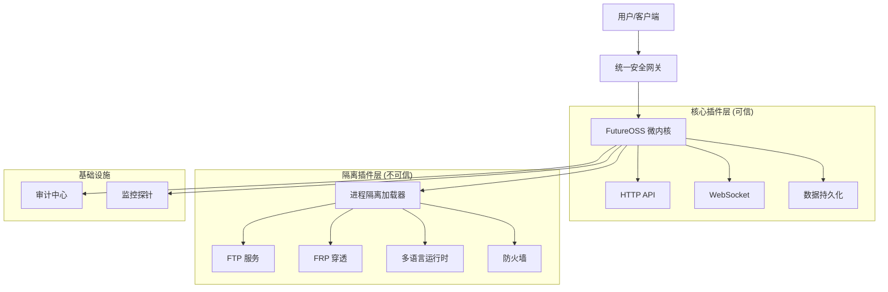

# FutureOSS v1.1.0 Security All-in-One Edition

<div align="center">


**面向未来的企业级插件化运行时框架**  
*安全 · 极简 · 全能 · 多语言*

[文档](#) | [下载](#) | [社区](#)

</div>

---

## 🚀 核心特性 (v1.1.0)

### 🛡️ 极致安全架构
- **进程级隔离**: 摒弃传统沙箱，采用 `ProcessIsolatedLoader` 确保第三方插件在独立进程运行，杜绝逃逸风险。
- **动态防火墙**: 内置状态检测防火墙，支持规则热加载。
- **统一审计**: 全链路操作日志记录与异常行为熔断机制。

### 🌐 全栈多语言支持
- **原生编排**: 一键部署 Python, Node.js, Go, Java, PHP 项目。
- **环境自治**: 自动检测运行时依赖，隔离环境配置。

### 🔧 企业运维套件
- **内网穿透**: 集成 FRP 客户端，可视化配置隧道。
- **文件服务**: 高性能 FTP/SFTP 服务器，支持断点续传。
- **自动化**: 定时备份、健康检查、故障自愈。

### 🎨 现代简约 WebUI
- **零依赖**: 纯 HTML5/CSS3/JS，无构建步骤，秒级加载。
- **响应式**: 完美适配 Desktop/Tablet/Mobile。
- **极简主义**: 专注内容本身，去除视觉干扰。

---

## 🏗️ 系统架构



---

## ⚡ 快速开始

### 1. 环境准备
```bash
# 需要 Python 3.10+
python --version
```

### 2. 安装与运行
```bash
# 克隆仓库
git clone https://github.com/FutureOSS/futureoss.git
cd futureoss

# 安装依赖
pip install -r requirements.txt

# 启动核心
python main.py
```

### 3. 访问控制台
打开浏览器访问 `http://localhost:8080` 体验全新的简约 WebUI。

---

## 📦 v1.1.0 更新日志

| 模块 | 变更详情 |
| :--- | :--- |
| **Security** | ✅ 移除 Python 沙箱，启用进程隔离 (`ProcessIsolatedLoader`) |
| **WebUI** | ✅ 从 PHP 迁移至静态 HTML，重构为极简设计风格 |
| **Plugins** | ✅ 新增 FTP, FRP, Firewall, Multi-Language 官方插件 |
| **Ops** | ✅ 集成自动化备份与健康检查工具 |
| **Docs** | ✅ 重写 README，增加架构图与标准化文档 |

---

## 🤝 贡献与许可

遵循 MIT 协议开源。欢迎提交 Issue 和 PR。

*Built with ❤️ by FutureOSS Team*
