<div align="center">
  
</div>

---

<div align="center">

## 📂 项目结构

</div>

```
FutureOSS/
├── 🚀  pyproject.toml                  # Python 项目配置
├── 📋  oss/                            # 核心框架包
│   ├── cli.py                          # CLI 命令入口
│   ├── config/                         # 配置系统
│   ├── logger/                         # 日志系统
│   ├── plugin/                         # 插件框架 (接口/加载器/管理器)
│   └── server/                         # HTTP 服务器
├── 🧩  store/                          # 本地插件仓库
│   └── @{作者/插件名}/                 # 插件目录 (含 manifest.json)
├── 📦  data/                           # 运行时数据目录
│   ├── html-render/                    # 网站文件 (通过 config.json 配置)
│   ├── web-toolkit/                    # Web 工具配置
│   ├── plugin-storage/                 # 插件存储配置
│   └── DCIM/                           # 共享存储
├── 🌐  website/                        # 官网 + 社区 (PHP)
└── 📖  static/                         # 静态资源 (SVG 背景等)
```

<div align="center">

## 📖 文档

</div>

完整开发者文档请查阅 [项目 Wiki](https://gitee.com/starlight-apk/feature-oss/wikis)：

| 📘 页面 | 📝 内容 |
|:---:|:---|
| [🎯 项目介绍](https://gitee.com/starlight-apk/feature-oss/wikis/项目介绍) | 什么是 FutureOSS、架构设计、核心概念 |
| [🚀 快速开始](https://gitee.com/starlight-apk/feature-oss/wikis/快速开始) | 安装、配置、第一次运行 |
| [🔌 插件开发](https://gitee.com/starlight-apk/feature-oss/wikis/插件开发) | 编写你的第一个插件、事件系统 |
| [📄 插件文档](https://gitee.com/starlight-apk/feature-oss/wikis/插件文档) | http-api、ws-api、file 插件详解 |
| [📦 包管理](https://gitee.com/starlight-apk/feature-oss/wikis/包管理) | 安装/卸载/搜索/发布插件 |
| [⚙️ 配置参考](https://gitee.com/starlight-apk/feature-oss/wikis/配置参考) | 配置参数详解 |
| [🚢 部署运维](https://gitee.com/starlight-apk/feature-oss/wikis/部署运维) | 本地运行、Docker、生产环境 |
| [🌟 社区与贡献](https://gitee.com/starlight-apk/feature-oss/wikis/社区与贡献) | 贡献指南、行为准则 |

<div align="center">

## 🔗 远程仓库

</div>

<div align="center">

| 📦 代码仓库 | 📚 包仓库 |
|:---:|:---:|
| [Gitee](https://gitee.com/starlight-apk/feature-oss) | [Gitee Pkg](https://gitee.com/starlight-apk/future-oss-pkg) |

</div>

---

<div align="center">

## 📜 许可证

**[Apache License 2.0](LICENSE)**

Copyright 2026 Falck

本项目采用 Apache 2.0 许可证 — 你可以自由使用、修改和分发，需保留版权和许可证声明。

---

### 📝 作者声明

> 本项目采用 Apache 2.0 开源许可证，此为独立于许可证的补充说明：

- 🚫 **禁止未经作者（Falck）明确书面许可的二次转发、搬运、转载**
- 🚫 **禁止冒充原作者或声称与官方项目存在关联**
- 🚫 **禁止移除、修改或遮盖版权声明、许可证和 NOTICE 文件**
- ✅ **允许个人学习、研究、商业使用（需保留版权和许可证信息）**

> 此声明不改变 Apache 2.0 许可证的法律效力，仅表达作者的合理期望。
> 如需特殊授权，请联系作者。

</div>

<div align="center">

---

<p>
  <strong>⚡ FutureOSS</strong> — 一切皆为插件
</p>

<p>
  Made with ❤️ by <a href="https://gitee.com/starlight-apk">Falck</a>
</p>

</div>
